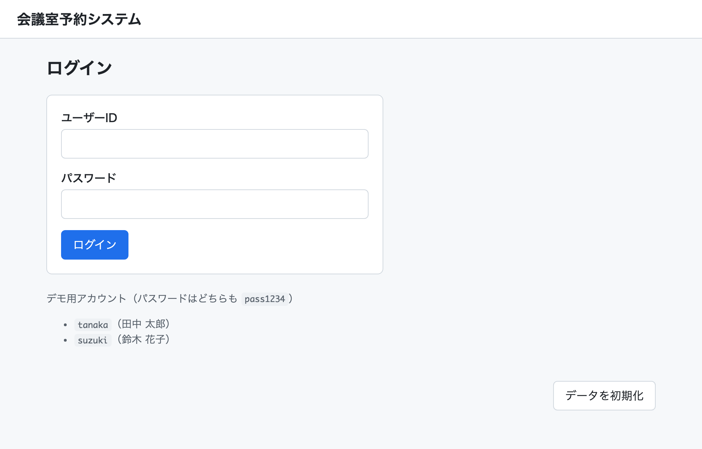
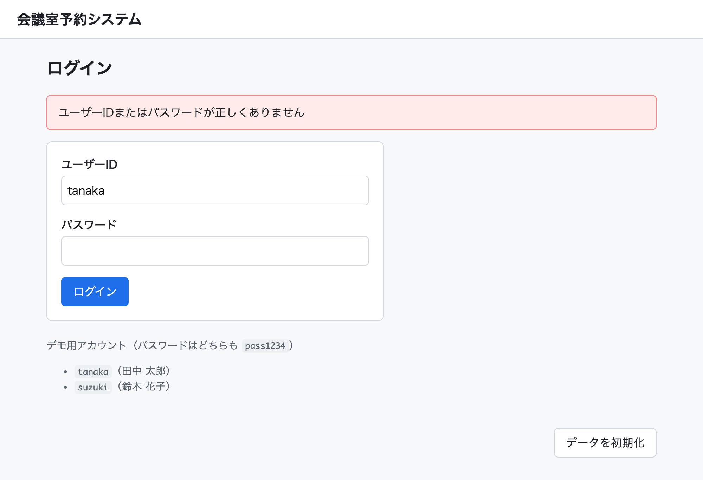
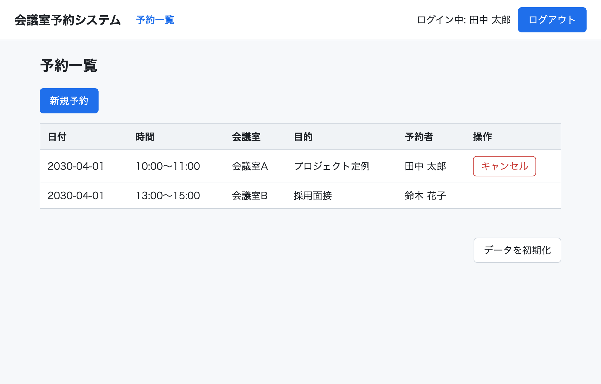
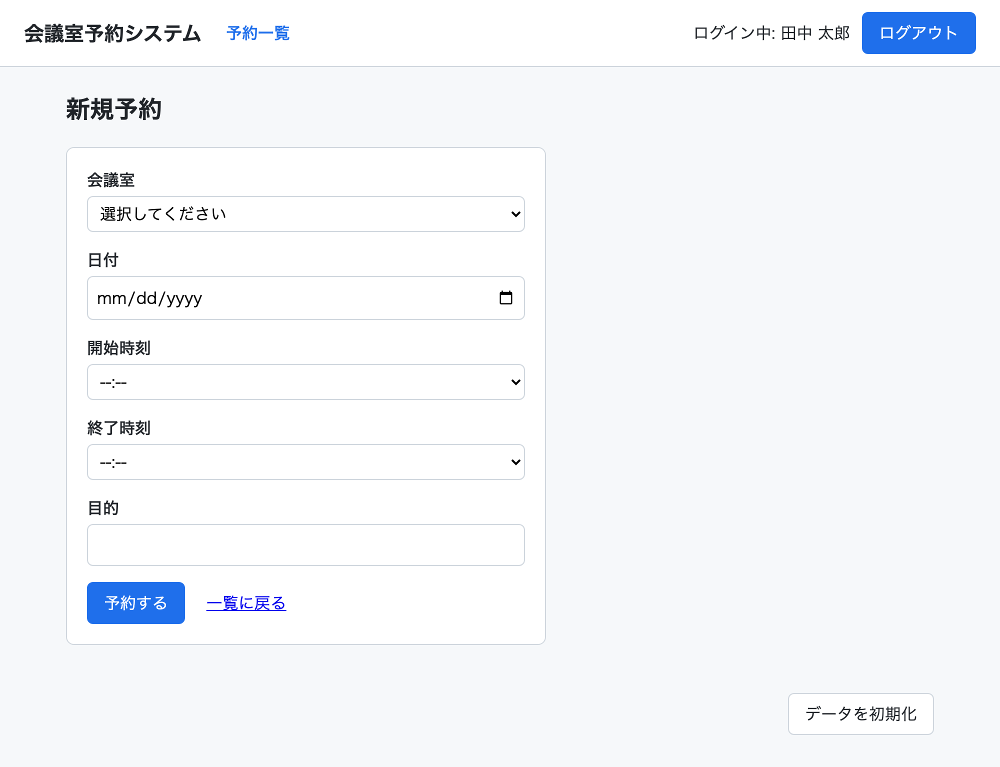
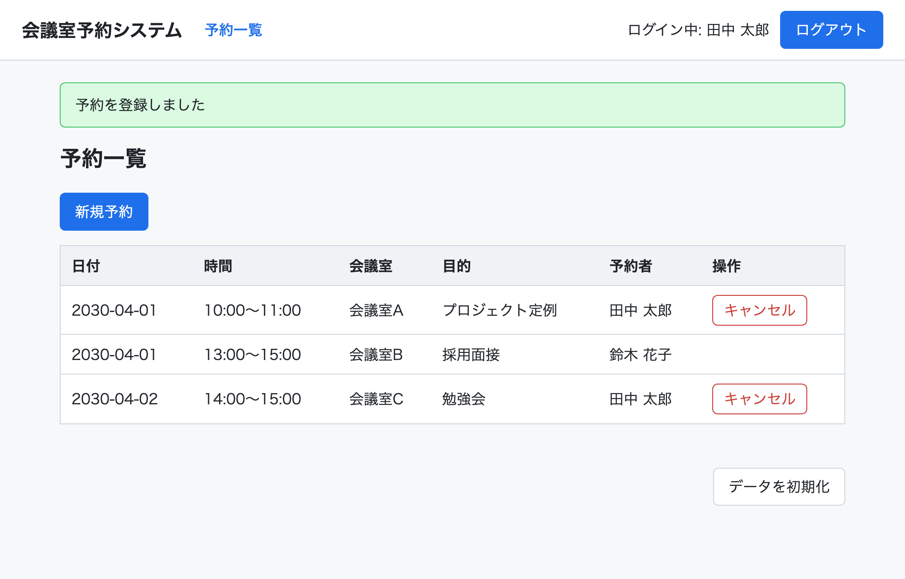
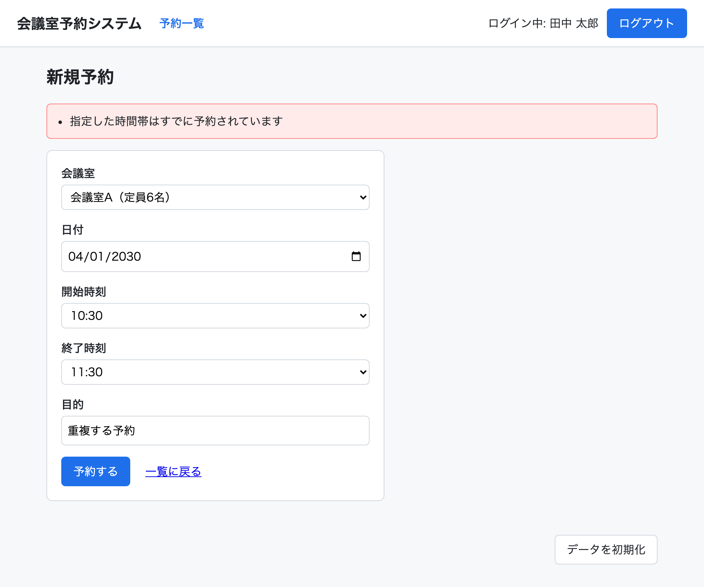

# 会議室予約システム ユーザーマニュアル

## 1. アプリケーションの起動

1. ターミナル（PowerShell またはコマンドプロンプト）を開き、このフォルダに移動します
2. 次のコマンドを実行します

   ```powershell
   npm start
   ```

3. 「会議室予約システムを起動しました: http://localhost:3000」と表示されたら、ブラウザで <http://localhost:3000> を開きます
4. 終了するときは、ターミナルで `Ctrl + C` を押します

## 2. ログイン



1. ユーザーIDとパスワードを入力し、「ログイン」ボタンを押します
2. ログインに成功すると予約一覧画面が表示されます

利用できるアカウントは画面下部に表示されています。

| ユーザーID | パスワード |
| --- | --- |
| tanaka | pass1234 |
| suzuki | pass1234 |

ユーザーIDまたはパスワードが間違っていると、エラーメッセージが表示されます。



## 3. 予約を確認する



ログインすると、全員の予約が日付順に一覧表示されます。
自分の予約には「キャンセル」ボタンが表示されます。

## 4. 予約を登録する

1. 予約一覧画面の「新規予約」ボタンを押します
2. 会議室・日付・開始時刻・終了時刻・目的を入力し、「予約する」ボタンを押します



登録が完了すると、予約一覧画面に「予約を登録しました」と表示され、一覧に追加されます。



入力内容に問題がある場合はエラーメッセージが表示されます。たとえば、すでに予約がある時間帯を指定した場合は次のように表示されます。



## 5. 予約をキャンセルする

予約一覧画面で、自分の予約の行にある「キャンセル」ボタンを押します。
確認ダイアログは表示されず、すぐにキャンセルされます。

## 6. ログアウト

ヘッダーの「ログアウト」ボタンを押すとログアウトし、ログイン画面に戻ります。

## 7. データを初期状態に戻す

演習中にデータを元に戻したいときは、画面下部の「データを初期化」ボタンを押してください。
予約データが初期状態（2 件の予約）に戻ります。アプリケーションを再起動しても同じように初期状態に戻ります。
